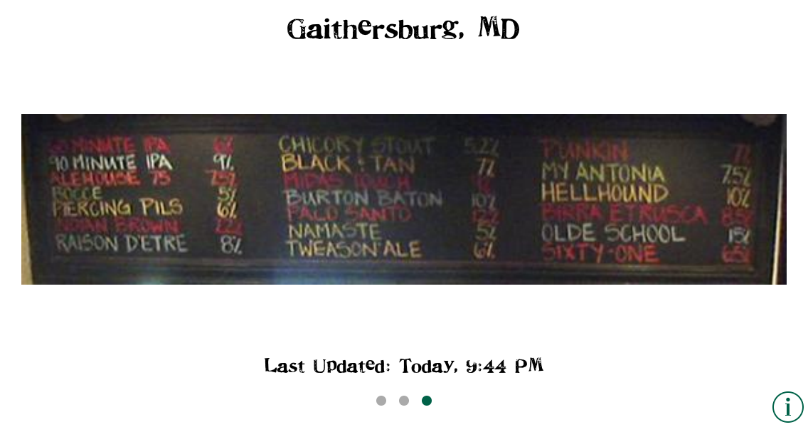
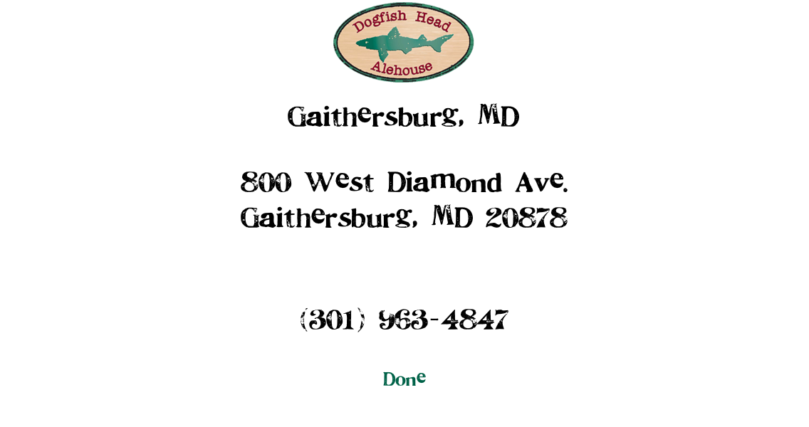

AleBoards
=========

Reimplementation of Dogfish Head Alehouse's [Aleboards](https://itunes.apple.com/us/app/aleboards/id299206419?mt=8&at=10l73r) app. DFH never updated the app for the iPhone 5's larger screen, or more recently, for iOS 7. This version supports both, as well as additional features like Dynamic Type, custom fonts, Google Maps, and more.

The behavior is nearly identical to the original app. Swipe between the different locations.

Press the information button to view the details.  Tapping the address will map the location in Apple or Google Maps. Tapping the phone number will call the location. Tapping the logo will go to the location's website.

